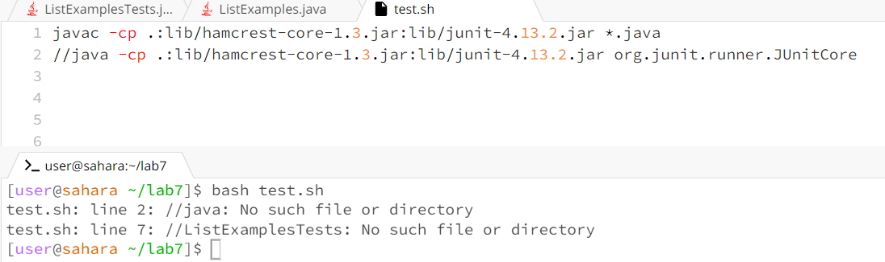
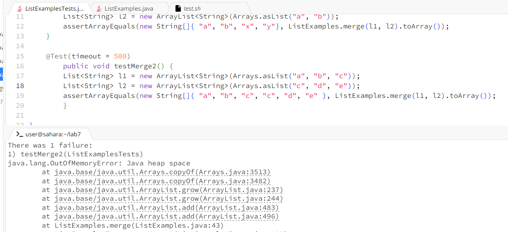

Lab report 5
===

Part1:
Student post:

the
I am not sure why my bash code is not running everything looks right I am not sure what is wrong with this code in my bash script

TA:
What your code is missing is to uncomment the second line in order for the junit test to run as well as adding at the end of the code the class name of the file where you are writing your test cases

Student post:

So I did what you said and now it works but I am not understanding whats wrong with my code right now I even put print statments and all I know is that it only prints one part of the array it is no adding the rest of the array.

