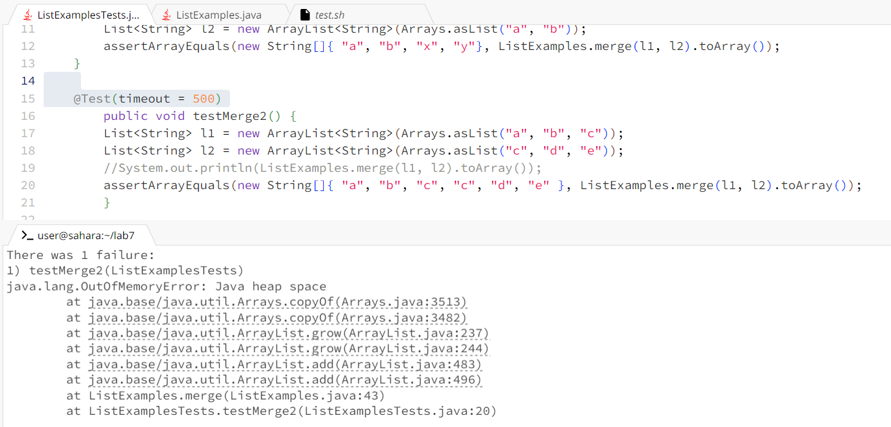

Lab report 5
===

Part1:
Student post:

I am not sure what is wrong with my code there seems with my testMerge junit test. This is the output that I have been given when I ran the program.

TA:
In order to further understand your code I suggest you to write print statements of what 

