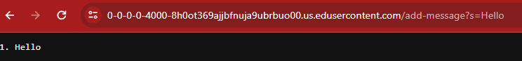

lab report 2
======
Part1

This is the code for String Server 

This is the messages that my code produced. For both of these message the are both calling the method String handleRequest(URI url). And it is also calling StringServer class to allow it to open a port where the user can interact with the server. Without the StringServer class it won't allow the code to run on a server or open up another port. For the method String handleRequest won't let the user be able to interact with the url search bar to add things or make changes.

For the messages below, the relevant arguments use is /add-message?s= is use for both of the outputs. They are relevant because without this the server will produce an error because it is not something that has been coded and its very specific on it. For example, in the image below it was added the Hello and if nothing was added after it and you click enter hello would be added many times with only the incementations of the counting the number of hellos.

For the second example, it has changes in which it added a message right after it added a string. which means if the inputs where all strings that were to be added the server would give an output.However, if it is not a string there be an error because the code written only takes string

