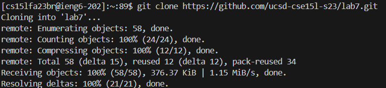
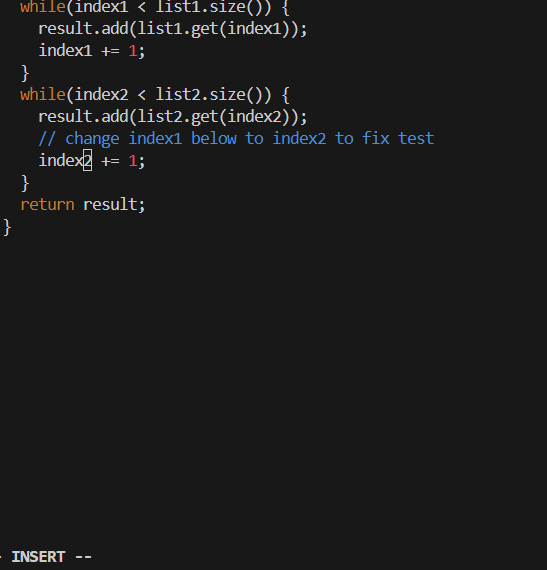
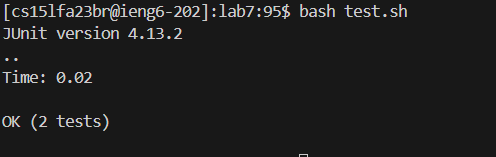
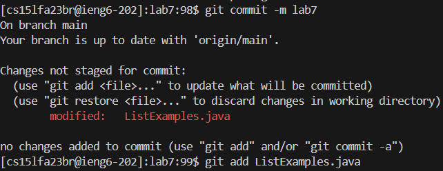
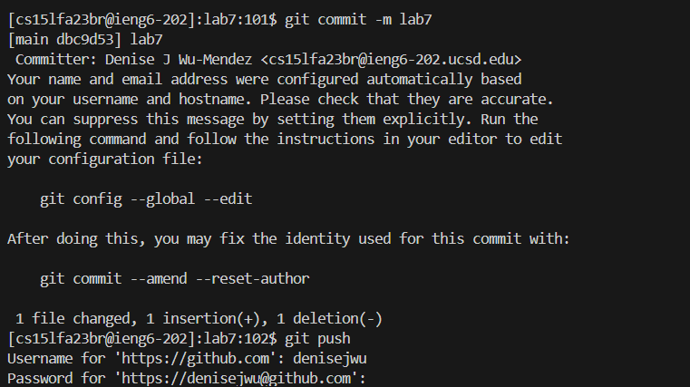

lab Report 7 
================
Step 4: log in ieng

keys pressed: 

~~~
<ssh cs15lfa23br@ieng6.ucsd.edu><enter>
~~~
Step 5: clone your for the repository from your github account

~~~
<git clone ctrl + v><enter> //I have already copied the linked of the repository already so I just pasted in
~~~

Step6: run test, and show that it failed

~~~
<cd lab7><enter><bash test.sh><enter>
~~~
Step7: edit code file

~~~
<vim ListExamples.java><enter><x><i><2><esc><:wq><enter>
~~~
Step8: run to show that it works

~~~
<up><up><enter>//since my history to run the program was up 2 times
~~~
Step9:commit and push into github account

~~~
<git commit><enter><git add ListExamples.java><enter><git commit -m lab7><enter><git push>
<[myusername]><enter><password><enter>
~~~
