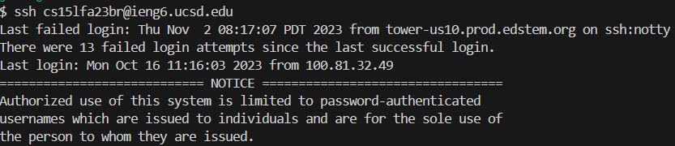

lab Report 7 
================
Step 4: log in ieng

keys pressed: 

~~~
<ssh cs15lfa23br@ieng6.ucsd.edu><git clone ctrl + v> 
~~~
Step 5: clone your for the repository from your github account
Step6: run test, and show that it failed
Step7: edit code file
Step8: run to show that it works
Step9:commit and push into github account
