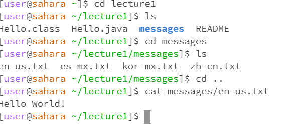

Lab Reports
===========
cd command with no files as an argument

cd command with a file agrument

ls directory as an argument (other words like a file)

ls with a file as an argument

cat with no argument(basically show every little thing like an image)

write one or two commonds of all the nine commands that you did and why the output was how it was. or like why it rand the way it ran

what would happend if the user were to type something and hit enter after running cat with no args should try that out. and screen shot what it did

ls command

ls commad to directory

Doesn't go to the directory instead ls goes to the files under lecture 1

ls commad to file

cat command

cat command w/ no argument has an error when it doesn't have any arguments because it needs to have an argument for it to run
cat command to directory 

cat command to file

