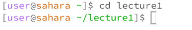
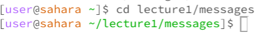
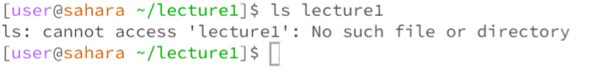
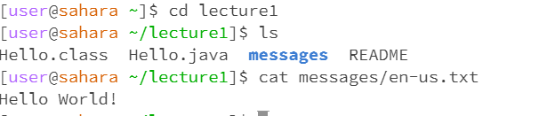
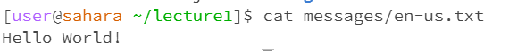

Lab Reports
===========
cd command with no files as an argument

cd command with a file agrument 

cd example of using the comand with a path to a file as argument

ls directory as an argument 

ls with a file as an argument

ls using the command witha path to file as an argument

cat command with no files

cat command to directory 

cat command to file

Examples of commands paths to a file

 write one or two commonds of all the nine commands that you did and why the output was how it was. or like why it rand the way it ran

 Explaination:

 cd command with no argument doesn't work because it needs a file name to change into a directory otherwise it will stay at home. Thats why once it has a file commad it is able to change the directory as indicated by the green beside the user in the direcotry. As for the path since lecture1 and messages is a directory is its able change the home directory into lecture1 and then find messages to get the file the user would want.

 ls command with no agrument allows the user to see what files are in a specific directory. Like once it is in the lecture1 directory they can see that it has Hello.java, messages, Hello.class to name a few. 
 

