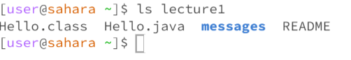

Lab Reports
===========
cd command with no files as an argument

cd command with a file agrument 

cd example of using the comand with a path to a file as argument

ls directory as an argument 

ls with a file as an argument

ls using the command witha path to file as an argument

cat command with no files

cat command to directory 

cat command to file

Examples of commands paths to a file, as well as ls command with no argument and other command that are not explicitly written are in the image below

 write one or two commonds of all the nine commands that you did and why the output was how it was. or like why it rand the way it ran

 Explaination:

 cd command with no argument doesn't work because it needs a file name to change into a directory otherwise it will stay at home. Once it has a directory file the cd command will change the directory into the file that was indicated. However, if you cd into a file it will not work because it is not a directory file.

 ls command with no agrument allows the user to see what files are in a specific directory. Like once it is in the lecture1 directory they can see that it has Hello.java, messages, Hello.class to name a few. If ls is given a directory path file and your in home you can see the files that are in that specific directory. Ls towards a specific file can such as messsages can show what is inside the file like in messages there are text files

 cat command with no argument doesn't do anything because it needs files to do something. Cat command doesnt work with directory files because the command combines to files that are within the directory otherwise it won't work it will print out that the file your trying to cat is a directory. cat command to a file will print two or more files contents depending on how many are being cat, the contents will be printed.
 

