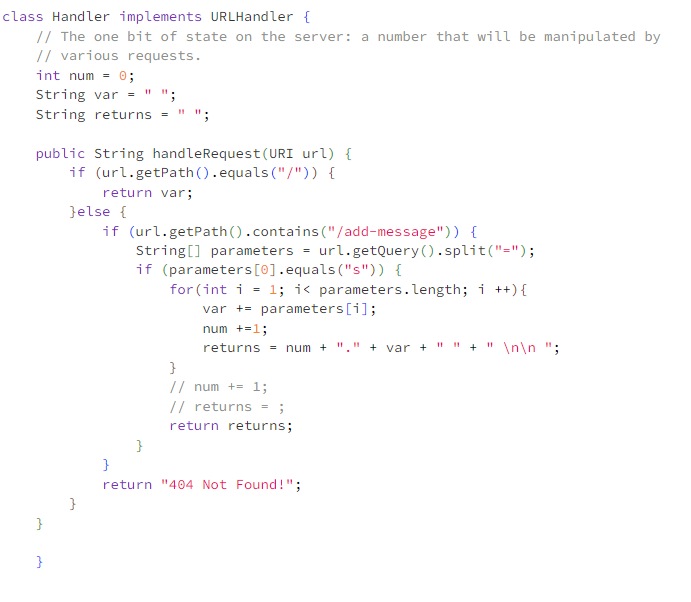
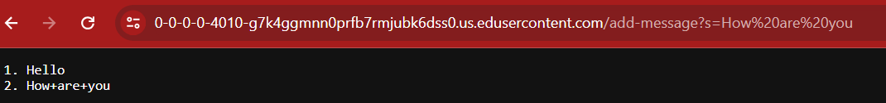

lab3
=====

Part1

My code

My code somewhat working

The methods my code is calling a getPath, getQuery methods. They are relevant arguments because it will look at the server url to see if the path contains certain signs such as "/" or if it has a certain string then the function will continue and the query is present because after there the message would be there and if it isn't it won't print anything. The values of the relevant fields of the class change based on what the user is inputting if the user doesn't print anything then the system won't run, however, if it does have the indicate values that are in getPath or getQuery then the system will run, it just has to be specific to what the programer has written.

Part 2

Got a little confuse with this

Part 3

Something that I have learned in this lab weeks is that I have come to have a much more deeper understanding of servers because I know you can remotely access a server just the how part was something that I learned and was able to do in lab. I also learned that there is so much that people can do with urls that I found so interesting just coding it came a little difficult to understand other than I found it very intersting. 
